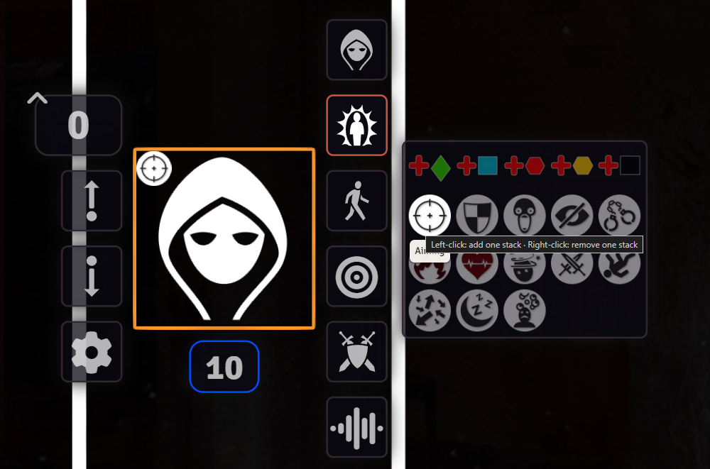
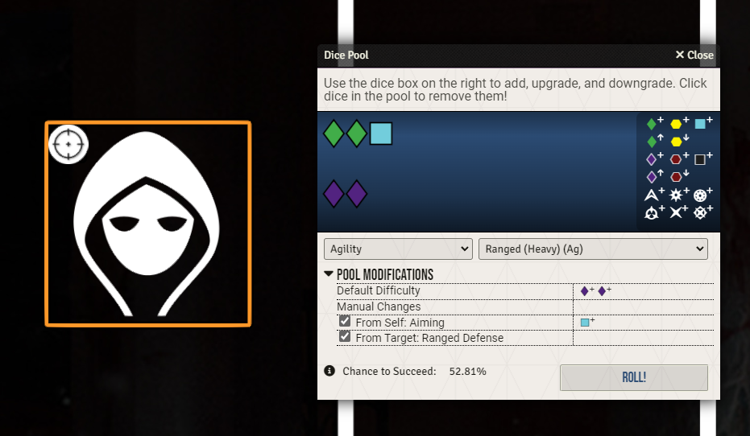

# Genesys Status Effects

This module replaces Foundry's generic default status icons (the ones you see when you right-click a token) with a set built specifically for Genesys. 
It also connects those statuses directly to the dice pool system, so relevant effects show up automatically in the roll dialog rather than requiring manual adjustment.

## Non Stackable Conditions
- Afraid
- Blind
- Bound
- Burning
- Critical Wound
- Disorientated
- Engaged
- Prone
- Staggered
- Suffocating
- Unconscious

The above are toggled on and off with a single click, just like normal status effects. 
Some of them carry automatic dice consequences according to the core rules.

## Stackable Conditions
- Add Ability
- Add Boost
- Add Challenge
- Add Proficiency
- Add Setback
- Aiming
- Burning
- Cover

The above work differently.
Each left-click adds one stack, right-click removes one stack. All of these, except for Burning, have automatic dice consequences according to the core rules. 

## The module comes with custom icons for each status effect
These can be customized in the Module Settings.

## Example of dice automation

## Disclamer

Using custom skills such as specific magic types may not trigger automatic dice calcucalation for Cover and or Aiming. 
Since Genesys is meant to me very modular, I cannot accommodate for all custom skills and have included the basic Ranged (light and heavy), Melee (light and heavy), Gunnery and Brawl as default.

